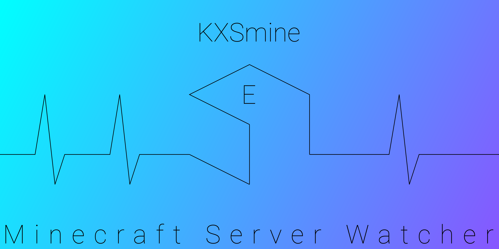

# KXSmine



### KXS custom format for NBT and sNBT
KXSmine is a Kotlin Multiplatform library and custom format backend for [kotlinx-serialization](https://github.com/Kotlin/kotlinx.serialization "kotlinx-serialization GitHub Repository") (KXS).
It supports encoding/decoding and serialization/deserialization of both the [NBT](https://minecraft.gamepedia.com/NBT_format "NBT Format Specification") (Named Binary Tag) and the sNBT (stringified NBT) format.
In addition to acting as a custom format backend for KXS, KXSmine also provides a standalone DSL for accessing data and building tags.

### About NBT
The Named Binary Tag format (NBT) is a data storage format internally used by the popular videogame [Minecraft](https://www.minecraft.net/en-us/ "Minecraft Homepage").
All concerns of data persistence, like player data, world data or metadata, are usually met by using NBT. Data encoded in the NBT format is a collection of bytes, organized in so-called Tags.
There are (currently) 13 different Tag Types: TAG_End, TAG_Byte, TAG_Short, TAG_Int, TAG_Long, TAG_Float, TAG_Double, TAG_Byte_Array, TAG_String, TAG_List, TAG_Compound, TAG_Int_Array and TAG_Long_Array.
Every Tag has an ID denoting its type, a name and a payload which differs in composition depending on the tag type. Here's an example of a compound tag:

```
0a 00 04 72 6f 6f 74 09 00 09 6c 69 73 74 49 74 65 6d 73 03 00 00 00 0c 00 00 00 01 00 00 00 01
00 00 00 02 00 00 00 03 00 00 00 05 00 00 00 08 00 00 00 0d 00 00 00 15 00 00 00 22 00 00 00 37
00 00 00 59 00 00 00 90 01 00 07 6f 6e 65 42 79 74 65 2a 08 00 0a 73 6f 6d 65 53 74 72 69 6e 67
00 0d 48 65 6c 6c 6f 2c 20 57 6f 72 6c 64 21 03 00 0a 6f 6e 65 49 6e 74 65 67 65 72 05 f5 e0 ff
09 00 09 63 6f 6d 70 6f 75 6e 64 73 0a 00 00 00 03 08 00 08 65 6e 74 72 79 30 78 30 00 08 53 6f
6d 65 44 61 74 61 04 00 08 65 6e 74 72 79 30 78 31 7f ff ff ff ff ff ff ff 07 00 08 65 6e 74 72
79 30 78 32 00 00 00 07 01 02 03 04 05 06 07 00 0c 00 08 65 6e 74 72 79 31 78 30 00 00 00 02 7f
ff ff ff ff ff ff ff 7f ff ff ff ff ff ff fe 06 00 08 65 6e 74 72 79 31 78 31 40 09 21 ca c0 83
12 6f 05 00 08 65 6e 74 72 79 31 78 32 40 2d f3 b6 00 0b 00 08 65 6e 74 72 79 32 78 30 00 00 00
08 00 00 00 01 00 00 00 02 00 00 00 04 00 00 00 08 00 00 00 10 00 00 00 20 00 00 00 40 00 00 00
80 02 00 08 65 6e 74 72 79 32 78 31 00 02 08 00 08 65 6e 74 72 79 32 78 32 00 0b 45 6e 64 20 6f
66 20 74 65 73 74 00 00
```

See below for a (human-readable) sNBT version of the same compound tag.

Usually, NBT data is stored in compressed (zipped) `.dat` files. KXSmine (currently) does not support compression / decompression or File I/O.
The output of a top-level encoder will be a `ByteArray`, just like the input for a top-level decoder is a `ByteArray` as well.

### About sNBT
The stringified variant of the NBT format (sNBT) is intended to provide a human-readable version of (binary) NBT data.
It is mostly used in [Minecraft Commands](https://minecraft.gamepedia.com/Commands "Explanation of Minecraft Commands") to allow the user to hard-code data into their commands.
Although being quite similar, the format is not the same as, nor in any way interoperable with, JSON. Here's an example of the same compound tag as above, but this time in sNBT Format:

```
root: {
    listItems: [
        1,
        1,
        2,
        3,
        5,
        8,
        13,
        21,
        34,
        55,
        89,
        144
    ],
    oneByte: 42b,
    someString: "Hello, World!",
    oneInteger: 99999999,
    compounds: [
        {
            entry0x0:SomeData,
            entry0x1:9223372036854775807l,
            entry0x2:[B;1,2,3,4,5,6,7]
        },
        {
            entry1x0: [L;
                9223372036854775807,
                9223372036854775806
            ],
            entry1x1: 3.1415d,
            entry1x2: 2.718f
        },
        {
            entry2x0: [I;
                1,
                2,
                4,
                8,
                16,
                32,
                64,
                128
            ],
            entry2x1: 2s,
            entry2x2: "End of test"
        }
    ]
}
```
Note that this snippet was "prettyfied" manually by me, and also not quite consistently. Yet, KXSmine will properly parse it, no matter how may whitespaces or linebreaks are at which locations.
However, KXSmine (currently) does not support prettyfying an encoded output programmatically. The output will always contain as few blank characters as it is minimally required to create a syntactically correct sNBT tag.

### About KXS
kotlinx-serialization (KXS) is a "kotlin multiplatform / multi-format reflectionless serialization" framework ([Source](https://github.com/Kotlin/kotlinx.serialization/blob/master/README.md "README of KXS")).
It supports the entire process of serializing an object from your program data, instantiated from a model class, to an encoded end format and vice versa. All of that is available for the
- Kotlin/JVM
- Kotlin/JS
- Kotlin/Native

platforms, which means you can use KXS and then connect to platform-native languages from there, like
- Java, Groovy, Scala for Kotlin/JVM,
- JavaScript, NodeJS, TypeScript for Kotlin/JS,
- C/C++, Rust, Objective-C, Swift for Kotlin/Native

Moreover, KXS is also "multi-format", meaning it provides a standard API for serialization, independent of the format you want to serialize to / deserialize from. Currently, the
- JSON
- ProtoBuf
- CBOR
- HOCON
- Properties

formats are supported in the official framework, with many more community-maintained formats (yaml, xml,...) being out there. With KXSmine, it's yet another format for the growing family!

# WIP Notice
This project is currently Work In Progress. To be precise, it is at the very beginning of development. The current sourcecode only contains fractions of the final state of the library.
Any content of this repository, including documentation and this very file, can be subject to drastic changes until this project reaches somewhat of an "alpha phase".
Documentation will subsequently be added to this file and the [Wiki](https://github.com/RaphaelTarita/KXSmine/wiki "KXSmine Wiki").
